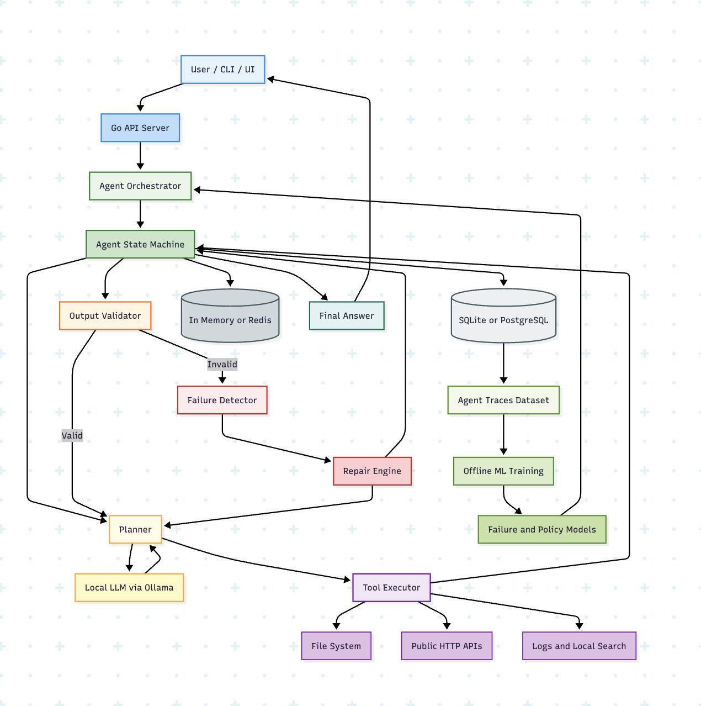

<p align="center">
  
</p>

<h1 align="center">OrchestAI</h1>

<p align="center">
  <strong>Self-healing agent orchestrator that diagnoses production crashes from log files</strong>
</p>

<p align="center">
  <a href="https://orchestai.onrender.com">Live Demo</a> · 
  <a href="#features">Features</a> · 
  <a href="#how-it-works">How It Works</a> · 
  <a href="#quick-start">Quick Start</a> · 
  <a href="#architecture">Architecture</a>
</p>

<p align="center">
  
  
  
  
  
</p>

---

## What is this?

**OrchestAI** is a self-healing AI agent orchestrator built in Go. Point it at a directory of log files from a crashed or misbehaving service, and it will:

1. **Read** every log file in the directory
2. **Detect** errors, panics, stack traces, and anomalies
3. **Diagnose** the root cause with supporting evidence
4. **Score** its confidence level (high / medium / low)
5. **Suggest** concrete next steps to fix the issue

If the analysis fails, the system **automatically retries, corrects inputs, or replans** — no human intervention needed.

> Think of it as a junior SRE that never sleeps. You get paged at 3 AM, hand it the logs, and get a structured incident report in seconds.

---

## Features

| Feature | Description |
|---|---|
| **Log Analysis** | Scans `.log`, `.txt`, `.out` files for errors, warnings, panics, and stack traces |
| **Root Cause Detection** | Identifies the primary failure and supporting evidence with exact file + line references |
| **Self-Healing** | Automatic retry, input correction, and replanning on failure |
| **Hallucination Grounding** | Cross-references AI evidence against actual log content — catches fabricated file names and log lines |
| **Replay** | Re-execute any past analysis from stored data without touching the original files |
| **File Upload** | Drag-and-drop log files through the browser — works on deployed instances |
| **Demo Mode** | Pre-loaded crash scenario (OOM + DB pool exhaustion) to showcase capabilities |
| **DAG Execution** | Steps can run in parallel with dependency resolution and cycle detection |
| **MCP Server** | Use from Claude Desktop, Cursor, or VS Code Copilot via Model Context Protocol |
| **100% Local** | No paid APIs, no cloud dependencies. Runs entirely on your machine |

---

## Live Demo

**[https://orchestai.onrender.com](https://orchestai.onrender.com)**

Click **"Try Demo"** to analyze a sample crash scenario — a Go server killed by OOM with Postgres connection pool exhaustion and Redis timeouts.

> Free tier — first load may take ~30s if the instance was sleeping.

---

## How It Works

<p align="center">
  
</p>

1. **Plan** — The planner builds a step graph: first scan the directory (`log_reader`), then analyze findings (`log_analyzer`)
2. **Execute** — Each agent step runs with access to filesystem tools (`fs.list_dir`, `fs.read_file`, `fs.grep_file`)
3. **Validate** — Output is checked against a report schema + grounding validation ensures evidence actually exists in the logs
4. **Repair** — On failure: classify the error → retry / correct input / replan → try again (up to configured limits)
5. **Persist** — Every run, step, and tool call is saved to SQLite for replay and metrics

---

## Quick Start

### Run Locally

```bash
# Clone
git clone https://github.com/bhavi-g/agent-orchestrator-go.git
cd agent-orchestrator-go

# Run
go run ./cmd/server

# Open
open http://localhost:8080
```

Click **"Try Demo"** or paste any log directory path (e.g., `/var/log/`) in the input bar.

### Run with Docker

```bash
docker build -t orchestai .
docker run -p 8080:8080 orchestai
```

### Analyze via API

```bash
# Create a run
curl -X POST http://localhost:8080/runs \
  -H "Content-Type: application/json" \
  -d '{"task_id": "crash-analysis", "input": {"directory": "/path/to/logs"}}'

# Check result
curl http://localhost:8080/runs/<run_id>

# View steps
curl http://localhost:8080/runs/<run_id>/steps

# View tool calls
curl http://localhost:8080/runs/<run_id>/tools

# Replay a run
curl -X POST http://localhost:8080/runs/<run_id>/replay
```

### Use with Claude Desktop (MCP)

```bash
# Build the MCP binary
go build -o ~/bin/agent-orchestrator-mcp ./cmd/mcp

# Add to Claude Desktop config (~/.config/claude/claude_desktop_config.json)
{
  "mcpServers": {
    "agent-orchestrator": {
      "command": "/Users/you/bin/agent-orchestrator-mcp"
    }
  }
}
```

Then ask Claude: *"Analyze the logs in /tmp/demo-logs"*

---

## Architecture

```
agent-orchestrator-go/
├── agent/           # Agent definitions (echo, log_reader, log_analyzer)
├── api/             # HTTP handlers and router
│   └── handlers/    # Run, upload, and metrics handlers
├── cmd/
│   ├── server/      # Web server entry point
│   └── mcp/         # MCP server for Claude/Cursor/Copilot
├── config/          # YAML configuration
├── demo/            # Embedded demo crash logs
├── failure/         # Failure classification (validation/tool/agent/unknown)
├── llm/             # Ollama LLM client, prompt templates, guardrails
├── orchestrator/    # Core engine: execution, validation, context, metrics
├── planner/         # Plan generators (dummy, log-analysis, context-aware, LLM)
├── repair/          # Self-healing: retry strategies, input correction
├── retry/           # Retry policies (exponential/linear/constant backoff)
├── storage/         # Repository interfaces
│   └── sqlite/      # SQLite implementation
├── telemetry/       # Observability hooks
├── tests/           # Integration & evaluation tests
├── tools/           # Filesystem tools (list_dir, read_file, grep_file)
├── validation/      # Output validation framework
└── web/             # Embedded static UI (ChatGPT-style)
```

### Key Components

| Component | Purpose |
|---|---|
| **Engine** | Plan → Execute → Validate loop with retry and replanning |
| **Agents** | `log_reader` scans directories; `log_analyzer` produces structured reports |
| **Tools** | `fs.list_dir`, `fs.read_file`, `fs.grep_file` — path-traversal protected |
| **Validators** | `ReportValidator` (schema), `GroundingValidator` (anti-hallucination) |
| **Repair** | `SimpleRetryStrategy`, `AdvancedStrategy` with input correction |
| **Persistence** | SQLite — every run/step/tool call recorded for replay |
| **Replay** | Re-execute from stored data without touching original files |

---

## Output Format

Every analysis produces a structured report:

```json
{
  "error_summary": "Server crashed with OOM kill after memory exceeded 2GB limit",
  "suspected_root_cause": "Unbounded query results combined with exhausted connection pool caused memory pressure",
  "supporting_evidence": [
    {
      "file": "app.log",
      "line_number": 12,
      "text": "FATAL out of memory: cannot allocate 256MB"
    },
    {
      "file": "error.log",
      "line_number": 1,
      "text": "CRITICAL: PostgreSQL connection pool exhausted (max=25, active=25, waiting=142)"
    }
  ],
  "confidence_level": "high",
  "suggested_next_steps": [
    "Increase memory limit or add pagination to the orders query",
    "Increase connection pool size or add connection timeout",
    "Add memory usage alerting before OOM threshold"
  ]
}
```

---

## API Reference

| Method | Endpoint | Description |
|---|---|---|
| `POST` | `/runs` | Create and execute a new analysis |
| `GET` | `/runs` | List all runs |
| `GET` | `/runs/:id` | Get run details |
| `GET` | `/runs/:id/steps` | Get execution steps |
| `GET` | `/runs/:id/tools` | Get tool call records |
| `POST` | `/runs/:id/replay` | Replay a run from stored data |
| `POST` | `/upload` | Upload log files (multipart/form-data) |
| `GET` | `/demo-dir` | Get path to embedded demo logs |
| `GET` | `/health` | Health check |
| `GET` | `/metrics` | Aggregate evaluation metrics |
| `GET` | `/metrics/:id` | Per-run evaluation metrics |

---

## Deploy Your Own

### Render (free)

1. Fork this repo
2. Go to [render.com](https://render.com) → **New** → **Web Service**
3. Connect your GitHub repo
4. Set **Runtime** to **Docker**, **Instance Type** to **Free**
5. Click **Create Web Service**

### Environment Variables (optional)

| Variable | Default | Description |
|---|---|---|
| `CONFIG_PATH` | `config/local.yaml` | Path to config file |
| `SQLITE_PATH` | `agent_runs.db` | SQLite database path |
| `UPLOAD_DIR` | `/tmp/agent-orchestrator-uploads` | Directory for uploaded files |

---

## Tech Stack

- **Go 1.25** — orchestration, API, agents
- **SQLite** (via `modernc.org/sqlite`) — persistence, pure Go, no CGO
- **Ollama** — optional local LLM for advanced planning
- **Vanilla JS** — ChatGPT-style web UI, no frameworks
- **Docker** — multi-stage Alpine build (~20MB image)

---

## Testing

```bash
# Run all tests
go test ./...

# Run with verbose output
go test -v ./tests/
```

The test suite includes:
- Golden path analysis (8 evaluation scenarios)
- Replay accuracy verification
- Grounding/hallucination detection
- DAG execution and parallel steps
- Self-healing and repair strategies
- API endpoint tests
- Tool registry contracts

---

## License

MIT

---

<p align="center">
  Built by <a href="https://github.com/bhavi-g">@bhavi-g</a>
</p>
